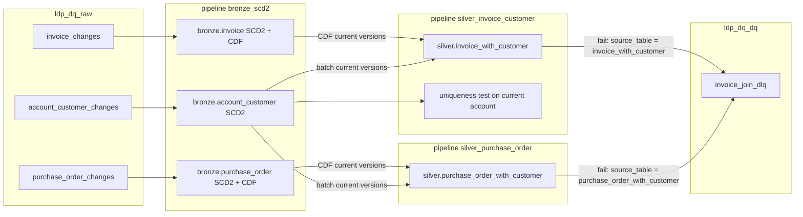
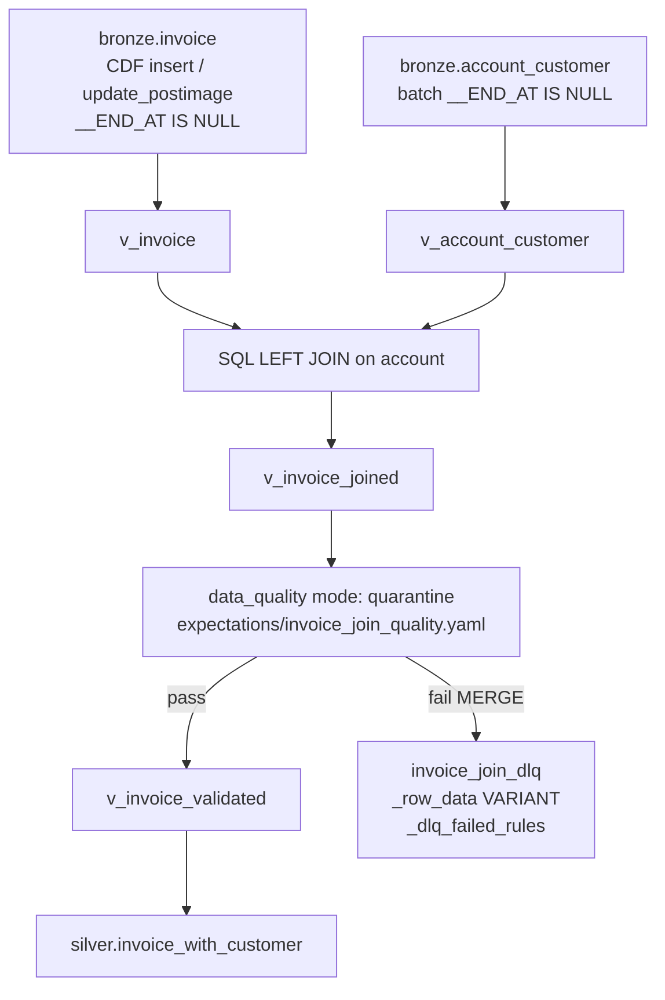
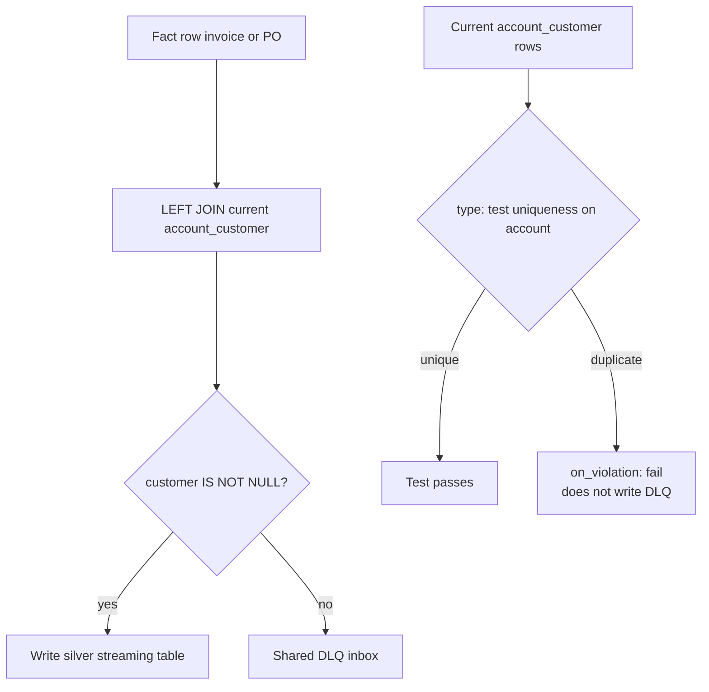
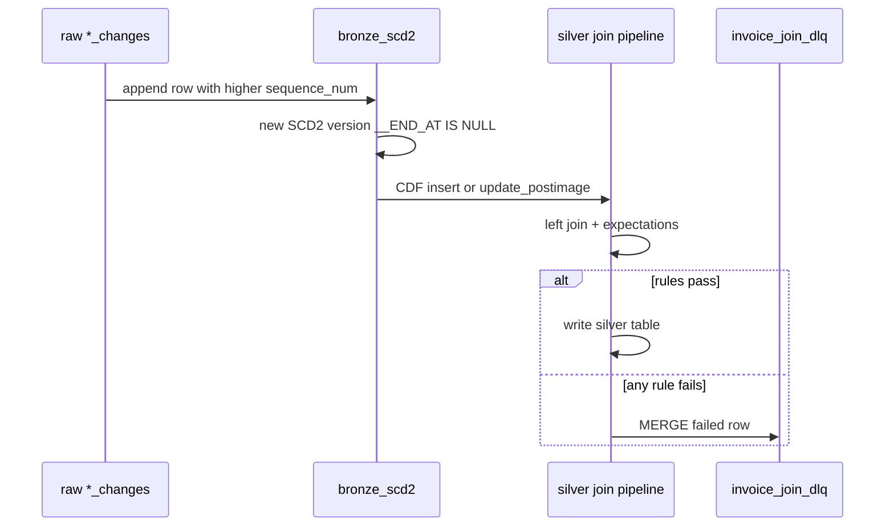

# ldp-dq

A LakehousePlumber DLT pipeline project.

## SCD2 bronze → join expectations → shared quarantine

Raw change tables feed LHP AUTO CDC `scd_type: 2` bronze tables. Silver reads new current SCD2 versions through Change Data Feed, joins the current `account_customer` version, and applies LHP `data_quality` (`mode: quarantine`). **Both fact pipelines MERGE failures into the same DLQ inbox** (`${catalog}.${dq_schema}.invoice_join_dlq`); `source_table` distinguishes invoice and PO rows.

To fix a failed row from bronze, append a newer raw change (`sequence_num` must increase), run `bronze_scd2`, then run the relevant silver pipeline. `sequence_num` is tracked so even an unchanged fact “touch” creates a new SCD2 version. A lookup-only correction does not emit a fact event, so reissue/touch the failed fact key too. See `pipelines/sample_data/fix_failed_records.sql`.

## Diagrams

### Pipelines and tables

Raw change tables land in `ldp_dq_raw`. Pipeline `bronze_scd2` applies AUTO CDC SCD Type 2 into `ldp_dq_bronze`. Two silver pipelines left-join facts to the current map; both MERGE failures into one DLQ. Optional `account_customer_dq` also writes that inbox, tagged by `source_table`. The uniqueness test is generated into `silver_invoice_customer` only with `--include-tests`.



### Silver views (invoice; PO is the same shape)

Join SQL and `data_quality` are separate LHP actions. The left join can emit `customer` nulls; quarantine expectations then split the stream.



### Join quarantine vs uniqueness test

A missing map row is a **row** failure (shared DLQ). Duplicate current `account` keys still join and fan out facts; that is a **pipeline test**, not quarantine.



### Bronze fix then silver recheck

Silver only sees a new event when bronze publishes a new **current** SCD2 version (CDF). Touch the fact key after a map-only correction.



Duplicate `account` keys in the map still join “successfully” and fan out invoices. The uniqueness test lives in the **same** Lakeflow pipeline (`silver_invoice_customer`); it is only emitted when you generate with `--include-tests`:

```bash
source .venv/bin/activate
lhp validate --env dev --include-tests -pc config/pipeline_config.yaml
lhp generate --env dev --include-tests -pc config/pipeline_config.yaml
databricks bundle deploy -t dev --profile fevm-ssas
```

| Path | Role |
|---|---|
| `pipelines/02_bronze_scd2/` | Raw CDC → SCD2 bronze tables |
| `pipelines/03_silver/invoice_with_customer.yaml` | Invoice join → quarantine → silver |
| `pipelines/03_silver/purchase_order_with_customer.yaml` | PO join → **same DLQ** → silver |
| `expectations/invoice_join_quality.yaml` | invoice_id, account, join match, customer name |
| `expectations/purchase_order_join_quality.yaml` | po_id, account, join match, customer name |
| `pipelines/sample_data/` | Raw CDC seeds, 100-row bulk demo, and append-only recovery SQL |
| `pipelines/dq/account_customer_uniqueness.yaml` | Same pipeline: uniqueness test (`--include-tests`) |

Workspace: [fevm-ssas-pbi-mv-migration](https://fevm-ssas-pbi-mv-migration.cloud.databricks.com/). Catalog `ssas_pbi_mv_migration_catalog`, schemas `ldp_dq_bronze` / `ldp_dq_silver` / `ldp_dq_dq`.

## Project Structure

- `pipelines/` - Pipeline configurations organized by pipeline name
- `presets/` - Reusable configuration presets
- `templates/` - Reusable action templates
- `substitutions/` - Environment-specific token and secret configurations
- `expectations/` - Data quality expectations
- `generated/` - Generated DLT pipeline code

## Getting Started

1. Create a pipeline directory:
   ```bash
   mkdir pipelines/my_pipeline
   ```

2. Create a flowgroup YAML file:
   ```bash
   touch pipelines/my_pipeline/ingestion.yaml
   ```

3. Validate your configuration:
   ```bash
   lhp validate --env dev
   ```

4. Generate DLT code:
   ```bash
   lhp generate --env dev
   ```

## Commands

- `lhp validate` - Validate pipeline configurations
- `lhp generate` - Generate DLT pipeline code
- `lhp list-presets` - List available presets
- `lhp list-templates` - List available templates
- `lhp show <flowgroup>` - Show resolved configuration

For more information, visit: https://docs.databricks.com/gcp/en/dlt and https://lakehouse-plumber.readthedocs.io/
